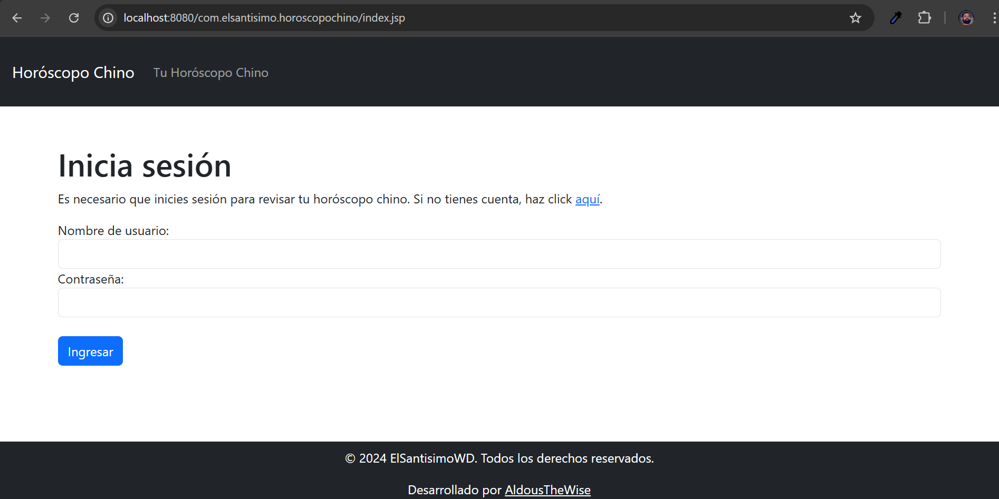
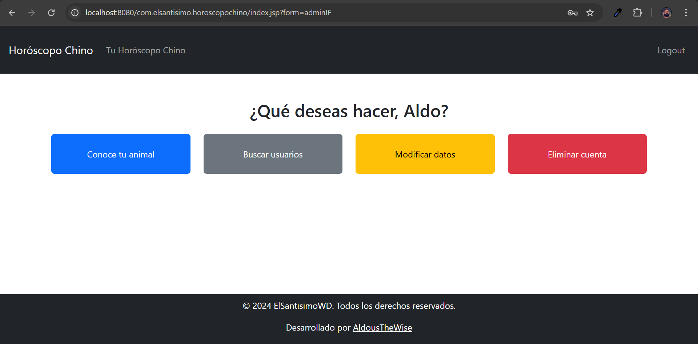
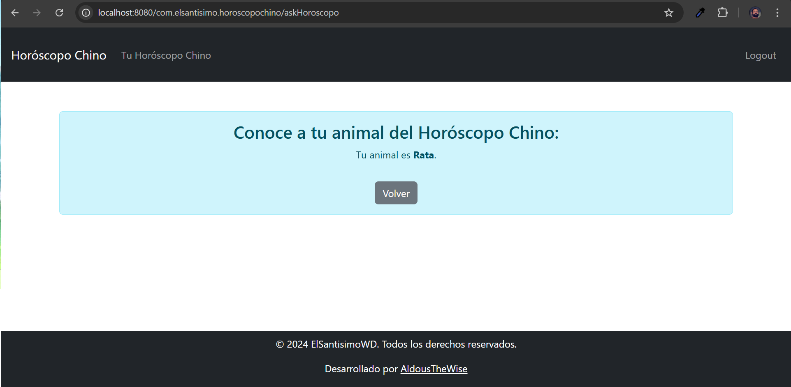

# 🐉 Horóscopo Chino

**Sistema de gestión de usuarios** desarrollado con **JSP**, **Servlets** y **JSTL**, utilizando **Bootstrap** para el diseño y **PostgreSQL** como base de datos. Este proyecto fue creado como parte de la evaluación del Módulo 5 del BootCamp de Desarrollo FullStack en Java (diciembre de 2024).

## 📋 Descripción

La aplicación permite a los usuarios registrarse e iniciar sesión para consultar su signo del horóscopo chino basado en su año de nacimiento. Se ha limitado el uso de JavaScript y no se emplea AJAX, Maven ni archivos XML, enfocándose en tecnologías estándar de Java EE.

## 🚀 Características

- Registro de usuarios con datos básicos.
- Inicio de sesión seguro.
- Consulta del signo del horóscopo chino según el año de nacimiento.
- Diseño responsivo gracias a Bootstrap.

## 🛠️ Tecnologías Utilizadas

- **Backend:**
  - JSP
  - Servlets
  - JSTL
- **Frontend:**
  - HTML5
  - CSS3
  - Bootstrap
- **Base de Datos:**
  - PostgreSQL
  - pgAdmin

## 🗄️ Estructura de la Base de Datos

La base de datos consta de dos tablas principales:

1. **usuario:**
   - `id` (PRIMARY KEY)
   - `nombre`
   - `apellido`
   - `email`
   - `fecha_nacimiento`
   - `password`

2. **horoscopo:**
   - `id` (PRIMARY KEY)
   - `signo`
   - `descripcion`
   - `rango_anios`

## ⚙️ Instalación y Configuración

1. **Clonar el repositorio:**
   ```bash
   git clone https://github.com/AldousTheWise/horoscopochino.git

2. **Configurar la base de datos:**
- Crear una base de datos en PostgreSQL.
- Ejecutar los scripts SQL proporcionados en el directorio sql/ para crear las tablas usuario y horoscopo.

3. **Configurar el servidor:**
- Desplegar la aplicación en un servidor compatible con Servlets y JSP, como Apache Tomcat.
- Asegurarse de que las credenciales de la base de datos en el archivo de configuración coincidan con las de tu entorno.

## 📸 Capturas de Pantalla

### 🖥️ Pantalla de Inicio de Sesión


### 🔮 Vista de la página principal


### 🔮 Vista de la lista de usuarios

